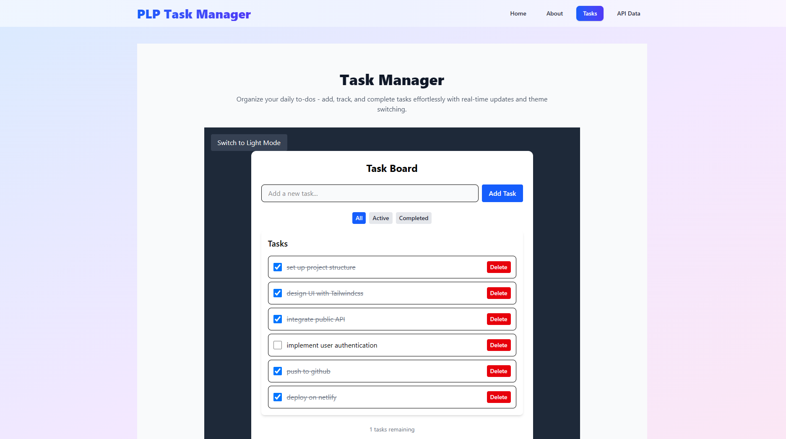

##### React.js, JSX, and Tailwind CSS – Mastering Front-End Development

# 🧠 React Task Manager with Theme Toggle

A clean and responsive React application that demonstrates component-driven development, state management, and API integration.  


## 🌟 Overview

This Task Manager allows users to add, view, and manage tasks, toggle between light/dark themes, and explore API data fetched from a public endpoint.  
It’s designed to showcase core React features - components, props, hooks, and context - combined with Tailwind CSS styling.


## 🚀 Features

- ✨ Task management (Add/Delete)
- 🌗 Light & Dark mode using Context API
- 📱 Fully responsive design (mobile-desktop)
- 🧭 React Router navigation
- 🔗 Public API data fetching with search & pagination
- 💅 Styled with Tailwind CSS + custom animations

## 🚀 Deployment
This project is deployed on Netlify.

### 📌 Live Demo
[View Live Demo](https://plp-reacttasks.netlify.app/)

## 🛠️ Technologies Used

- **React 19**
- **React Router DOM**
- **Context API**
- **Tailwind CSS v4**
- **Vite** (fast build tool)


## ⚙️ Setup Instructions

1. **Clone the repository**
   ```bash
   git clone https://github.com/PLP-MERN-Stack-Development/react-js-jsx-and-css-mastering-front-end-development-vee-kodes.git

   cd react-js-jsx-and-css-mastering-front-end-development-vee-kodes
   ```

2. **Install Dependencies**
```bash
npm install
```

3. **Start Development Server**
```bash
npm run dev
```

4. **Navigate to `http://localhost:5173` in your browser.**

## 🧩 Project Structure
```markdown
reactTask/
├── src/
│   ├── components/
│   │   ├── ui/
│   │   │   ├── Button.jsx
│   │   │   ├── Card.jsx
│   │   │   ├── Navbar.jsx
│   │   │   └── Footer.jsx
│   │   ├── Layout.jsx
│   │   └── TaskManager.jsx
│   │
│   ├── context/
│   │   └── ThemeContext.jsx
│   │
│   ├── pages/
│   │   ├── Home.jsx
│   │   ├── About.jsx
│   │   ├── Tasks.jsx
│   │   └── ApiData.jsx
│   │
│   ├── App.jsx
│   ├── main.jsx
│   └── index.css
│
├── index.html
├── screenshots/
│           ├── task-manager.png
└── README.md
```

## 🔍 Usage
- Navigate between pages using the top menu
- Switch between light and dark themes
- Manage your task list
- Explore public API data via the "API Data" page


## 🖼️ Screenshots

### Task Manager Interface


*Task manager interface showing dark mode toggle and task management features*

### Features Shown:
- Task Board with Add Task functionality
- Filter tabs (All, Active, Completed)
- Theme toggle button
- Responsive navigation
- Task list with completion status


## 🧠 Assignment Requirements Met
- ✅ Component Creation
- ✅ Props Implementation
- ✅ State Management
- ✅ Event Handling
- ✅ Context API Usage
- ✅ React Router Integration
- ✅ API Data Fetching
- ✅ Responsive Design
- ✅ Code Organization
- ✅ Documentation


